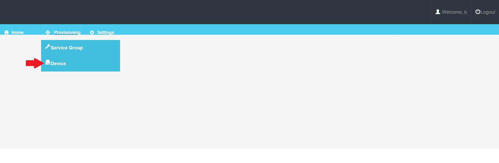
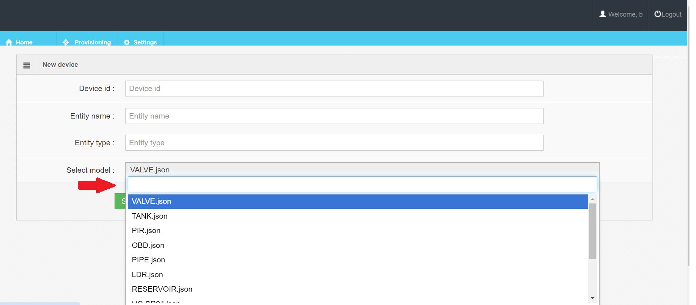
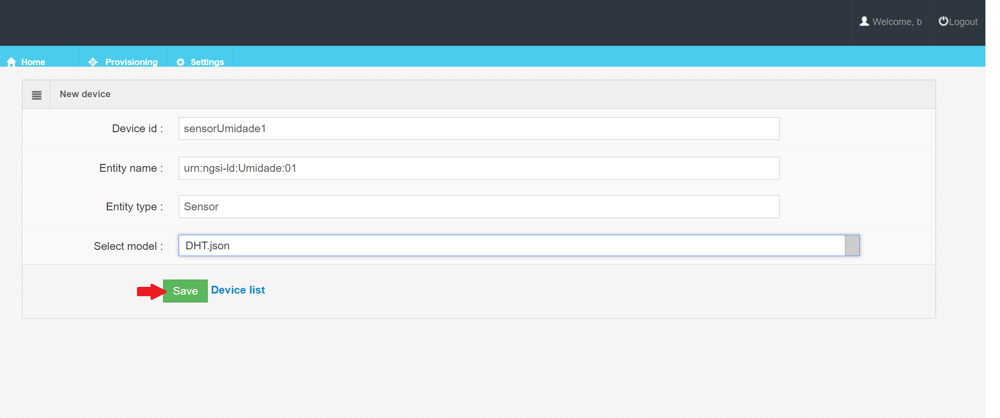
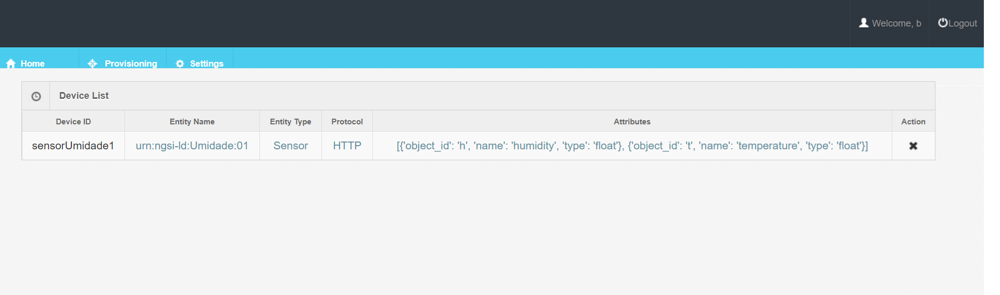

## Creating a Device

- On the interface, select **Device**

## Creating an Attribute

- On the interface, in **Select model**, Select the model compatible with your sensor. 

- fill in the form with your device data and click in *save*.

Esta solicitação provisiona um dispositivo no **Agente IoT**.

- Device created. *Click in Device list*

Observe que o dispositivo tem 2 atributos (`t` no **Agente IoT** e `temperature` no **Orion**; e `h` no **Agente IoT** e `humidity` no **Orion**).

[!info] Agora que o **Agent IoT** está conectado, o grupo de serviço definiu o recurso no qual o **Agente IoT** está escutando (`iot/json`) e a chave de API usada para autenticar a solicitação (`ec65734d95ad4bb68a4da3e67049725e`). Uma vez que ambos são reconhecidos, a medição será válida.

Como provisionamos especificamente o dispositivo (`sensorUmidade1`) - o **Agente IoT** pode mapear atributos antes de gerar uma solicitação com o **Orion**.

Obs: Não se esqueça de adicionar os cabeçalhos `fiware-service:reflexiot` e `fiware-service-path:/` no arduino.