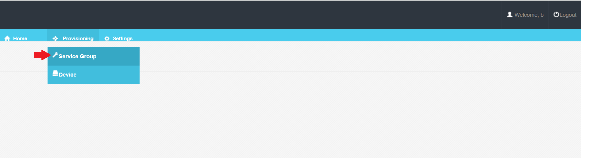
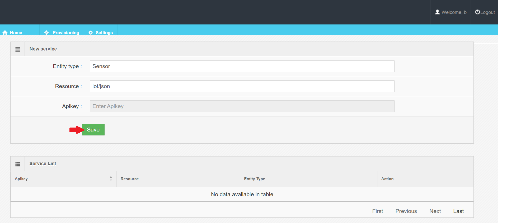
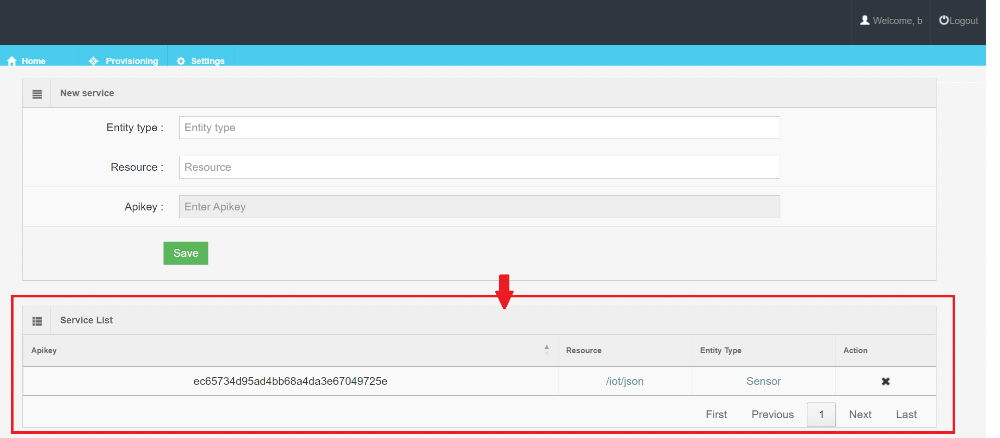

## Creating a Service Group

Provisionar um grupo de serviço é a primeira etapa na conexão de dispositivos. É sempre necessário fornecer uma *Apikey* de autenticação com cada medição e o **Agente IoT** não saberá inicialmente em qual URL o agente de contexto está respondendo.


- On the interface, select **Provisioning -> Service Group**. 



- O serviço indicado tem as seguintes características. Fill in the form with your service and click in *save*.



- Service Group created.




No exemplo, o **Agente IoT** é informado que o endpoint `/iot/json` será usado e que os dispositivos se autenticarão incluindo a apikey `ec65734d95ad4bb68a4da3e67049725e`. Para um **Agente IoT JSON**, isso significa que os dispositivos enviarão solicitações GET ou POST para:

```
http://agentjson:7896/iot/json?i=<device_id>&k=ec65734d95ad4bb68a4da3e67049725e
```

Quando uma medição do dispositivo (e.g. sensor umidade) é enviada pelo arduino na URL do recurso, ela precisa ser interpretada e passada para o **Orion**. O atributo `entity_type` fornece um `type` padrão para cada dispositivo que fez uma solicitação (neste caso, os dispositivos anônimos serão conhecidos como entidades `Device`.
